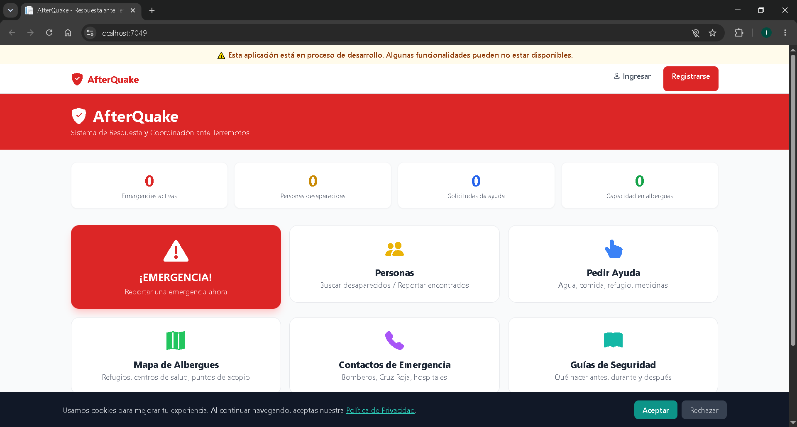

# AfterQuake — Sistema de Respuesta y Coordinación ante Terremotos

[](ScreenShots/1.png)

[](https://youtu.be/2_2osQ7-_Jc?si=omw1Tv_T3QD6HZZN)

Plataforma web integral para la gestión de emergencias sísmicas, diseñada para activarse **ANTES**, **DURANTE** y **DESPUÉS** de un sismo de gran magnitud. Construida con **ASP.NET Core MVC 8**, **Clean Architecture**, **SQL Server**, y orientada 100% a dispositivos móviles.

> **Prioridad absoluta: CLARIDAD.** Cada usuario debe entender en menos de 5 segundos qué puede hacer en cada pantalla, incluso bajo estrés extremo, baja conectividad y uso masivo simultáneo.

---

## Índice

1. [Arquitectura del Proyecto](#arquitectura-del-proyecto)
2. [Stack Tecnológico Detallado](#stack-tecnológico-detallado)
3. [Estructura de Carpetas Completa](#estructura-de-carpetas-completa)
4. [Modelo de Datos — 26 Tablas Explicadas](#modelo-de-datos--26-tablas-explicadas)
5. [Diagrama de Relaciones entre Entidades](#diagrama-de-relaciones-entre-entidades)
6. [Capas de la Arquitectura](#capas-de-la-arquitectura)
   - [Domain Layer](#1-afterquakedomain---capa-de-dominio)
   - [Application Layer](#2-afterquakeapplication---capa-de-aplicación)
   - [Infrastructure Layer](#3-afterquakeinfrastructure---capa-de-infraestructura)
   - [Web Layer](#4-afterquakeweb---capa-de-presentación)
7. [Roles de Usuario y Permisos](#roles-de-usuario-y-permisos)
8. [Módulos Funcionales](#módulos-funcionales)
9. [Flujo de Navegación Completo](#flujo-de-navegación-completo)
10. [Controladores y Acciones](#controladores-y-acciones)
11. [API REST — Endpoints](#api-rest--endpoints)
12. [Middleware Pipeline](#middleware-pipeline)
13. [Seguridad en Profundidad](#seguridad-en-profundidad)
14. [Tiempo Real con SignalR](#tiempo-real-con-signalr)
15. [PWA — Progressive Web App (Offline)](#pwa--progressive-web-app-offline)
16. [Internacionalización (ES/EN)](#internacionalización-esen)
17. [Servicios de Background (Jobs Programados)](#servicios-de-background-jobs-programados)
18. [Health Checks y Monitoreo](#health-checks-y-monitoreo)
19. [Logging con Serilog](#logging-con-serilog)
20. [Pruebas Unitarias](#pruebas-unitarias)
21. [Guía de Configuración Local](#guía-de-configuración-local)
22. [Guía de Despliegue](#guía-de-despliegue)
23. [Escalamiento Horizontal con Redis](#escalamiento-horizontal-con-redis)
24. [Consideraciones de Rendimiento](#consideraciones-de-rendimiento)
25. [Contribuir](#contribuir)
26. [Licencia](#licencia)

---

## Arquitectura del Proyecto

AfterQuake sigue **Clean Architecture** (también conocida como Arquitectura Hexagonal o de Puertos y Adaptadores) con 4 proyectos principales más uno de tests:

```
AfterQuake/
├── src/
│   ├── AfterQuake.Domain/              # Capa más interna — sin dependencias externas
│   ├── AfterQuake.Application/         # Casos de uso, DTOs, interfaces, validadores
│   ├── AfterQuake.Infrastructure/      # Persistencia, servicios concretos, EF Core
│   └── AfterQuake.Web/                 # Presentación MVC, Razor Views, API, SignalR
├── tests/
│   └── AfterQuake.Tests/               # Tests unitarios (xUnit + Moq + EF InMemory)
├── docs/                               # Documentación adicional
├── AfterQuake.sln                      # Solución que agrupa todos los proyectos
├── README.md                           # Este archivo
└── .gitignore
```

### Principios de Clean Architecture aplicados:

| Principio | Cómo se aplica |
|-----------|---------------|
| **Independencia del Framework** | ASP.NET Core es solo la capa de presentación; Domain y Application no referencian ningún framework web |
| **Testabilidad** | Domain/Application no tienen dependencias de infraestructura; se pueden testear con mocks |
| **Independencia de la UI** | La UI puede cambiarse (MVC → Web API → Blazor) sin tocar el negocio |
| **Independencia de la BD** | SQL Server puede reemplazarse por PostgreSQL/MySQL cambiando solo Infrastructure |
| **Dependencias hacia adentro** | Web → Infrastructure → Application → Domain (nunca al revés) |

### Regla de dependencias:

```
Web ───→ Infrastructure ───→ Application ───→ Domain
  │                              │
  └──────────────────────────────┘
       (Web también depende de Application directamente)
```

Web depende de **Infrastructure** (para resolver implementaciones) y **Application** (para interfaces).  
Infrastructure depende de **Application** (implementa sus interfaces) y **Domain** (usa entidades).  
Application depende solo de **Domain** (define interfaces que Infrastructure implementa).  
Domain no depende de **nadie**.

---

## Stack Tecnológico Detallado

| Capa | Tecnología | Versión | Propósito |
|------|-----------|---------|-----------|
| **Runtime** | .NET | 8.0 | Plataforma de ejecución cross-platform |
| **Framework Web** | ASP.NET Core MVC | 8.0 | Patrón MVC con Razor Views |
| **ORM** | Entity Framework Core | 8.0 | ORM Code-First con Fluent API |
| **Base de Datos** | SQL Server | 2019+ | Motor de base de datos relacional |
| **Cache Distribuido** | StackExchange Redis | 2.8+ | Caché y backplane de SignalR |
| **Autenticación** | ASP.NET Core Identity | 8.0 | 5 roles, lockout, cookies seguras |
| **UI Framework** | Tailwind CSS | CDN | CSS utility-first responsive |
| **Iconos** | Bootstrap Icons | CDN | Biblioteca de iconos SVG |
| **Mapas** | Leaflet.js + OpenStreetMap | 1.9.4 | Mapas interactivos sin API key |
| **Tiempo Real** | SignalR | 8.0 | WebSocket con fallback a SSE/Long Polling |
| **Validación** | FluentValidation | 11.9 | Validación declarativa con mensajes en español |
| **Logging** | Serilog | 8.0+ | Logging estructurado a archivo y consola |
| **Imágenes** | SixLabors.ImageSharp | 3.1.7 | Redimensionado y thumbnails de fotos |
| **Testing** | xUnit + Moq | 2.5/4.20 | Tests unitarios con InMemory database |
| **PWA** | Service Worker API | Nativa | Offline cache, manifest.json |
| **Health Checks** | ASP.NET Core Health Checks | 8.0 | Endpoints /health/ready y /health/live |

---

## Estructura de Carpetas Completa

```
AfterQuake/
│
├── src/
│   ├── AfterQuake.Domain/
│   │   ├── Common/
│   │   │   ├── BaseEntity.cs               # Clase base con Id, CreatedAt, UpdatedAt, IsDeleted
│   │   │   └── ValueObject.cs              # (futuro) Para objetos de valor
│   │   ├── Entities/
│   │   │   ├── ApplicationUser.cs          # Usuario extendido de Identity (27 propiedades)
│   │   │   ├── EmergencyReport.cs          # Reporte de emergencia SOS
│   │   │   ├── PersonReport.cs             # Persona desaparecida/encontrada
│   │   │   ├── HelpRequest.cs              # Solicitud de ayuda
│   │   │   ├── HelpOffer.cs                # Oferta de ayuda
│   │   │   ├── Shelter.cs                  # Albergue/refugio
│   │   │   ├── Donation.cs                 # Donación
│   │   │   ├── DonationPoint.cs            # Punto de acopio
│   │   │   ├── HealthCenter.cs             # Centro de salud
│   │   │   ├── Volunteer.cs                # Voluntario
│   │   │   ├── VolunteerTask.cs            # Tarea asignada a voluntario
│   │   │   ├── Alert.cs                    # Alerta oficial
│   │   │   ├── ServiceStatus.cs            # Estado de servicio público
│   │   │   ├── ContactDirectory.cs         # Contacto de emergencia
│   │   │   ├── GuideContent.cs             # Guía de seguridad
│   │   │   ├── Notification.cs             # Notificación push
│   │   │   ├── AuditLog.cs                 # Log de auditoría
│   │   │   ├── DisasterZone.cs             # Zona de desastre
│   │   │   └── UnidentifiedPatient.cs      # Paciente no identificado en hospital
│   │   ├── Enumerations/
│   │   │   ├── EmergencyType.cs            # Fire, Collapse, Flood, Medical, etc.
│   │   │   ├── EmergencySeverity.cs        # Critical, High, Medium, Low
│   │   │   ├── EmergencyStatus.cs          # Pending, Assigned, InProgress, Resolved
│   │   │   ├── PersonReportType.cs         # Missing, Found
│   │   │   ├── PersonReportStatus.cs       # Active, Resolved, Closed
│   │   │   ├── HelpRequestType.cs          # Water, Food, Medical, Shelter, Rescue, Supplies
│   │   │   ├── HelpRequestPriority.cs      # Low, Medium, High, Critical
│   │   │   ├── HelpRequestStatus.cs        # Pending, Assigned, InProgress, Resolved
│   │   │   ├── HelpOfferType.cs            # Transport, Supplies, Labor, Medical, Shelter, Other
│   │   │   ├── ShelterStatus.cs            # Active, Full, Closed, Damaged
│   │   │   ├── DonationType.cs             # Monetary, InKind
│   │   │   ├── DonationStatus.cs           # Pending, Received, Distributed, Cancelled
│   │   │   ├── VolunteerStatus.cs          # Available, Unavailable, Busy, Offline
│   │   │   ├── VolunteerTaskStatus.cs      # Assigned, InProgress, Completed, Cancelled
│   │   │   ├── AlertSeverity.cs            # Info, Warning, Critical, Evacuation
│   │   │   ├── AlertType.cs                # Aftershock, Tsunami, Evacuation, Curfew, Biological, Other
│   │   │   ├── ServiceType.cs              # Water, Electricity, Gas, Communications, Roads, Health, Internet
│   │   │   ├── ServiceStatusType.cs        # Operational, Limited, Interrupted, UnderRepair
│   │   │   ├── DisasterZoneLevel.cs        # Green, Yellow, Orange, Red
│   │   │   └── AuditAction.cs              # Create, Update, Delete, Login, Export, etc.
│   │   └── Interfaces/
│   │       ├── IRepository.cs              # Interfaz genérica del repositorio
│   │       └── IUnitOfWork.cs              # Interfaz de Unit of Work
│   │
│   ├── AfterQuake.Application/
│   │   ├── DTOs/
│   │   │   ├── EmergencyReportDto.cs       # DTO de emergencia + CreateEmergencyReportDto
│   │   │   ├── PersonReportDto.cs          # DTO de persona + CreatePersonReportDto + ReportFoundDto + PersonSearchDto
│   │   │   ├── HelpRequestDto.cs           # DTO de ayuda + CreateHelpRequestDto
│   │   │   ├── ShelterDto.cs               # DTO de albergue
│   │   │   ├── AlertDto.cs                 # DTO de alerta + CreateAlertDto
│   │   │   ├── DonationDto.cs              # DTO de donación + CreateDonationDto
│   │   │   ├── VolunteerDto.cs             # DTO de voluntario + RegisterVolunteerDto
│   │   │   ├── DashboardDto.cs             # DTO del dashboard con todas las métricas
│   │   │   ├── PagedResult.cs              # Resultado paginado genérico
│   │   │   └── UpdateServiceStatusDto.cs   # DTO para actualizar estado de servicio
│   │   ├── Interfaces/
│   │   │   ├── IEmergencyService.cs        # Contrato del servicio de emergencias
│   │   │   ├── IPersonReportService.cs     # Contrato del servicio de personas
│   │   │   ├── IHelpRequestService.cs      # Contrato del servicio de solicitudes de ayuda
│   │   │   ├── IShelterService.cs          # Contrato del servicio de albergues
│   │   │   ├── IAlertService.cs            # Contrato del servicio de alertas
│   │   │   ├── IDashboardService.cs        # Contrato del servicio de dashboard
│   │   │   ├── INotificationService.cs     # Contrato del servicio de notificaciones
│   │   │   ├── IGeoService.cs              # Contrato del servicio de geolocalización
│   │   │   ├── IHaversineService.cs        # Contrato del cálculo de distancia
│   │   │   ├── IFileUploadService.cs       # Contrato del servicio de archivos
│   │   │   └── IGeocodingService.cs        # Contrato del servicio de geocodificación inversa
│   │   └── Validators/
│   │       ├── CreateEmergencyReportValidator.cs    # Valida reporte de emergencia
│   │       ├── CreateHelpRequestValidator.cs        # Valida solicitud de ayuda
│   │       ├── CreatePersonReportValidator.cs       # Valida reporte de persona
│   │       ├── ReportFoundValidator.cs              # Valida reporte de persona encontrada
│   │       ├── RegisterViewModelValidator.cs        # Valida registro de usuario
│   │       ├── LoginViewModelValidator.cs           # Valida inicio de sesión
│   │       └── CreateDonationValidator.cs           # Valida donación
│   │
│   ├── AfterQuake.Infrastructure/
│   │   ├── Data/
│   │   │   ├── ApplicationDbContext.cs     # DbContext con 19 DbSets + Fluent API completa
│   │   │   ├── UnitOfWork.cs               # Implementación con SaveChangesAsync
│   │   │   ├── Repository.cs               # Repositorio genérico con Query, FindAsync, etc.
│   │   │   ├── DesignTimeDbContextFactory.cs # Factory para migraciones EF Core
│   │   │   └── Migrations/                 # Migraciones generadas por EF Core
│   │   ├── Services/
│   │   │   ├── EmergencyService.cs         # CRUD de emergencias + resolución
│   │   │   ├── PersonReportService.cs      # CRUD + búsqueda + cruce de coincidencias
│   │   │   ├── HelpRequestService.cs       # CRUD + asignación + resolución
│   │   │   ├── ShelterService.cs           # CRUD de albergues + disponibilidad
│   │   │   ├── AlertService.cs             # CRUD de alertas + publicación
│   │   │   ├── DashboardService.cs         # Métricas agregadas del dashboard
│   │   │   ├── NotificationService.cs      # Notificaciones por usuario/rol/zona
│   │   │   ├── FileUploadService.cs        # Upload de imágenes con ImageSharp
│   │   │   ├── HaversineService.cs         # Cálculo de distancia geográfica
│   │   │   ├── GeocodingService.cs         # Geocodificación inversa (OpenStreetMap Nominatim)
│   │   │   └── BackgroundJobsService.cs    # Jobs programados (cada 5/10/15 min)
│   │   └── Seed/
│   │       └── ApplicationDbContextSeed.cs # Datos semilla (admin, roles, contactos, guías)
│   │
│   ├── AfterQuake.Web/
│   │   ├── Controllers/
│   │   │   ├── HomeController.cs           # Landing page, SOS, números de emergencia
│   │   │   ├── EmergencyController.cs      # Lista de emergencias, reportar, resolver
│   │   │   ├── PersonController.cs         # Personas desaparecidas/encontradas, hospitales
│   │   │   ├── HelpRequestController.cs    # Solicitudes de ayuda, asignar, resolver
│   │   │   ├── ShelterController.cs        # Albergues en mapa y lista
│   │   │   ├── DonationController.cs       # Donaciones, creación, transparencia
│   │   │   ├── VolunteerController.cs      # Voluntarios, registro, tareas, check-in/out
│   │   │   ├── GuideController.cs          # Guías de seguridad
│   │   │   ├── DirectoryController.cs      # Directorio de contactos, estado de servicios
│   │   │   ├── AccountController.cs        # Login, registro, logout
│   │   │   ├── AdminController.cs          # Dashboard admin, alertas, servicios
│   │   │   └── Api/
│   │   │       ├── EmergencyApiController.cs   # API de emergencias
│   │   │       ├── PersonApiController.cs      # API de personas
│   │   │       ├── HelpApiController.cs        # API de ayuda
│   │   │       └── MapApiController.cs         # API de mapa (albergues, centros, donación, nearby)
│   │   ├── Views/
│   │   │   ├── Home/
│   │   │   │   └── Index.cshtml           # Landing con SOS, tarjetas de estado, acceso rápido
│   │   │   ├── Emergency/
│   │   │   │   ├── Index.cshtml           # Lista de emergencias activas con badges
│   │   │   │   └── Report.cshtml          # Formulario wizard de reporte SOS
│   │   │   ├── Person/
│   │   │   │   ├── Index.cshtml           # Búsqueda dual desaparecidos/encontrados
│   │   │   │   ├── Details.cshtml         # Detalle de persona con coincidencias
│   │   │   │   ├── ReportMissing.cshtml   # Formulario de persona desaparecida
│   │   │   │   ├── ReportFound.cshtml     # Formulario de persona encontrada
│   │   │   │   ├── ImSafe.cshtml          # Página "Estoy a salvo"
│   │   │   │   └── HospitalPatients.cshtml # Pacientes no identificados en hospitales
│   │   │   ├── HelpRequest/
│   │   │   │   ├── Index.cshtml           # Lista de solicitudes con filtros
│   │   │   │   └── Create.cshtml          # Formulario de solicitud de ayuda
│   │   │   ├── Shelter/
│   │   │   │   ├── Map.cshtml             # Mapa Leaflet con todos los albergues
│   │   │   │   └── List.cshtml            # Lista de albergues con disponibilidad
│   │   │   ├── Donation/
│   │   │   │   ├── Index.cshtml           # Estadísticas y feed de donaciones
│   │   │   │   ├── Create.cshtml          # Formulario de donación
│   │   │   │   └── Transparency.cshtml    # Reporte de transparencia
│   │   │   ├── Volunteer/
│   │   │   │   ├── Index.cshtml           # Lista de voluntarios disponibles
│   │   │   │   ├── Register.cshtml        # Formulario de registro
│   │   │   │   └── MyTasks.cshtml         # Tareas asignadas con check-in/out
│   │   │   ├── Guide/
│   │   │   │   ├── Index.cshtml           # Lista de guías con iconos
│   │   │   │   └── Details.cshtml         # Contenido completo de la guía
│   │   │   ├── Directory/
│   │   │   │   ├── Index.cshtml           # Directorio de emergencia + otros contactos
│   │   │   │   └── ServiceStatus.cshtml   # Estado de servicios públicos
│   │   │   ├── Account/
│   │   │   │   ├── Login.cshtml           # Inicio de sesión
│   │   │   │   ├── Register.cshtml        # Registro de usuario
│   │   │   │   └── AccessDenied.cshtml    # Página de acceso denegado
│   │   │   ├── Admin/
│   │   │   │   ├── Dashboard.cshtml       # Dashboard con métricas en tiempo real
│   │   │   │   ├── Users.cshtml           # Gestión de usuarios
│   │   │   │   ├── Reports.cshtml         # Reportes administrativos
│   │   │   │   ├── CreateAlert.cshtml     # Crear alerta oficial
│   │   │   │   └── ManageServices.cshtml  # Gestionar estado de servicios
│   │   │   ├── Shared/
│   │   │   │   ├── _Layout.cshtml         # Layout principal con nav, footer, SignalR, PWA
│   │   │   │   ├── _ValidationScriptsPartial.cshtml  # Scripts de validación cliente
│   │   │   │   └── _EmergencyNumbers.cshtml           # Partial de números de emergencia
│   │   │   └── _ViewImports.cshtml        # Usings globales para todas las vistas
│   │   ├── Hubs/
│   │   │   ├── NotificationHub.cs         # Hub de notificaciones push
│   │   │   └── EmergencyHub.cs            # Hub de emergencias en tiempo real
│   │   ├── Middleware/
│   │   │   ├── RateLimitingMiddleware.cs   # Rate limiter sliding window (5/30 req/min)
│   │   │   └── LocalizationMiddleware.cs   # Detección de idioma (cookie, query, header)
│   │   ├── Filters/
│   │   │   └── SecurityHeadersFilter.cs   # CSP, HSTS, X-Frame-Options, etc.
│   │   ├── HealthChecks/
│   │   │   └── AfterQuakeHealthCheck.cs   # Health check personalizado con validación de datos
│   │   ├── Services/
│   │   │   └── LocalizationService.cs     # Servicio de traducción ES/EN (50+ strings)
│   │   ├── wwwroot/
│   │   │   ├── service-worker.js          # Service Worker para PWA offline
│   │   │   ├── manifest.json              # Manifest de PWA
│   │   │   ├── offline.html               # Página offline
│   │   │   ├── css/site.css               # Tailwind + custom CSS (modo pánico)
│   │   │   ├── js/site.js                 # JavaScript global
│   │   │   └── uploads/photos/            # Fotos de personas subidas
│   │   ├── Program.cs                     # Punto de entrada: DI, middleware, seed, configuración
│   │   ├── appsettings.json               # Configuración (connection string, logging)
│   │   └── appsettings.Development.json   # Configuración de desarrollo
│   │
│   └── AfterQuake.sln                     # Solución que agrupa los 5 proyectos
│
├── tests/
│   └── AfterQuake.Tests/
│       ├── Services/
│       │   ├── EmergencyServiceTests.cs   # 5 tests: Create, GetActive, Resolve, GetById, GetActiveCount
│       │   ├── PersonReportServiceTests.cs # 5 tests: Create, ReportFound, SearchByName, SearchByZone, GetPotentialMatches
│       │   └── HaversineServiceTests.cs   # 4 tests: distance, within radius, outside radius, zero distance
│       └── AfterQuake.Tests.csproj        # Proyecto de tests con xUnit + EF InMemory
│
└── docs/                                 # Documentación adicional
```

---

## Modelo de Datos — 26 Tablas Explicadas

### 1. Tablas de Identity (8 tablas)

| Tabla | Propósito | Columnas clave |
|-------|-----------|---------------|
| `AspNetUsers` | Usuarios del sistema (hereda IdentityUser) | Id, UserName, Email, FullName, DocumentId, EmergencyContact, LastLatitude, LastLongitude, LastLocationUpdate, HasVerifiedEmergency, PreferredLanguage, RegisteredAt, LastLoginAt, IsActive |
| `AspNetRoles` | Roles del sistema | Id, Name, NormalizedName |
| `AspNetUserRoles` | Asignación usuario ↔ rol | UserId, RoleId |
| `AspNetUserClaims` | Claims adicionales de usuario | Id, UserId, ClaimType, ClaimValue |
| `AspNetUserLogins` | Logins externos (Google, Facebook, etc.) | LoginProvider, ProviderKey, ProviderDisplayName, UserId |
| `AspNetUserTokens` | Tokens (reset password, 2FA, etc.) | UserId, LoginProvider, Name, Value |
| `AspNetRoleClaims` | Permisos por rol | Id, RoleId, ClaimType, ClaimValue |
| `__EFMigrationsHistory` | Historial de migraciones EF | MigrationId, ProductVersion |

### 2. Tablas de Negocio (18 tablas)

#### Módulo de Emergencia

**`EmergencyReports`** — Reporte de emergencia (SOS)
| Columna | Tipo | Descripción |
|---------|------|-------------|
| Id | GUID (PK) | Identificador único |
| EmergencyType | int (enum) | Fire, Collapse, Flood, Medical, GasLeak, StructuralDamage, TrappedPerson, Other |
| Severity | int (enum) | Critical, High, Medium, Low |
| Status | int (enum) | Pending, Assigned, InProgress, Resolved |
| Latitude, Longitude | double | Coordenadas GPS del reporte |
| Address | nvarchar(MAX) | Dirección textual |
| ZoneCode | nvarchar(450) | Código de zona (ej: "ZONA-DN", "ZONA-SD") |
| Description | nvarchar(MAX) | Descripción de la emergencia |
| AffectedPeople | int? | Número de personas afectadas |
| RequiresImmediateRescue | bit | Requiere rescate inmediato |
| ReporterName | nvarchar(MAX) | Nombre de quien reporta |
| ReporterPhone | nvarchar(MAX) | Teléfono de contacto |
| ReportedAt | datetime2 | Fecha/hora del reporte |
| ResolvedAt | datetime2? | Fecha/hora de resolución |
| ResolutionNotes | nvarchar(MAX) | Notas de resolución |
| UserId | nvarchar(450) FK→AspNetUsers | Usuario que reportó (nullable para anónimos) |
| AssignedToVolunteerId | GUID? FK→Volunteers | Voluntario asignado |

**`Alerts`** — Alertas oficiales emitidas por autoridades
| Columna | Tipo | Descripción |
|---------|------|-------------|
| Id | GUID (PK) | Identificador único |
| Title | nvarchar(MAX) | Título de la alerta |
| Message | nvarchar(MAX) | Mensaje detallado |
| AlertType | int (enum) | Aftershock, Tsunami, Evacuation, Curfew, Biological, Other |
| Severity | int (enum) | Info, Warning, Critical, Evacuation |
| ZoneCode | nvarchar(450) | Zona geográfica afectada |
| Latitude, Longitude | double? | Coordenadas del epicentro/zona |
| RadiusKm | double? | Radio de afectación en km |
| IsActive | bit | Alerta vigente |
| ExpiresAt | datetime2? | Fecha de expiración |
| PublishedAt | datetime2 | Fecha de publicación |
| PublishedById | nvarchar(450) FK→AspNetUsers | Autor que publicó |

**`DisasterZones`** — Zonas geográficas con nivel de alerta
| Columna | Tipo | Descripción |
|---------|------|-------------|
| Id | GUID (PK) | Identificador único |
| ZoneCode | nvarchar(450) **UNIQUE** | Código único de zona |
| ZoneName | nvarchar(MAX) | Nombre descriptivo |
| ZoneLevel | int (enum) | Green, Yellow, Orange, Red |
| Latitude, Longitude | double | Centro de la zona |
| RadiusKm | double | Radio de la zona |
| Description | nvarchar(MAX) | Descripción de la zona afectada |
| AffectedPopulation | int? | Población afectada estimada |
| IsActive | bit | Zona vigente |

#### Módulo de Personas

**`PersonReports`** — Reporte dual: persona desaparecida O encontrada
| Columna | Tipo | Descripción |
|---------|------|-------------|
| Id | GUID (PK) | Identificador único |
| ReportType | int (enum) | Missing (desaparecido) o Found (encontrado) |
| Status | int (enum) | Active, Resolved, Closed |
| MissingPersonName | nvarchar(450) | Nombre de la persona (indexado para búsqueda) |
| Age | int? | Edad aproximada |
| Gender | nvarchar(MAX) | Género |
| Description | nvarchar(MAX) | Descripción física detallada |
| PhysicalCharacteristics | nvarchar(MAX) | Características físicas distintivas |
| LastKnownClothing | nvarchar(MAX) | Vestimenta que usaba |
| PhotoUrl | nvarchar(MAX) | URL de la foto |
| LastKnownLatitude, LastKnownLongitude | double? | Coordenadas donde fue visto por última vez |
| LastKnownAddress | nvarchar(MAX) | Dirección donde fue visto |
| ZoneCode | nvarchar(450) | Zona del reporte |
| LastSeenAt | datetime2? | Cuándo fue visto por última vez |
| ContactName | nvarchar(MAX) | Nombre de contacto |
| ContactPhone | nvarchar(MAX) | Teléfono de contacto |
| ContactEmail | nvarchar(MAX) | Email de contacto |
| ReportedAt | datetime2 | Fecha del reporte |
| FoundAt | datetime2? | Cuándo fue encontrado |
| FoundBy | nvarchar(MAX) | Quién lo encontró |
| FoundLatitude, FoundLongitude | double? | Dónde fue encontrado |
| FoundNotes | nvarchar(MAX) | Notas del hallazgo |
| UserId | nvarchar(450) FK→AspNetUsers | Usuario que reportó |
| MatchedToReportId | GUID? FK→PersonReports (self) | Coincidencia con otro reporte |

**`UnidentifiedPatients`** — Pacientes no identificados en hospitales
| Columna | Tipo | Descripción |
|---------|------|-------------|
| Id | GUID (PK) | Identificador único |
| HospitalName | nvarchar(MAX) | Nombre del hospital |
| Description | nvarchar(MAX) | Descripción del paciente |
| PhysicalDescription | nvarchar(MAX) | Descripción física |
| Clothing | nvarchar(MAX) | Vestimenta |
| EstimatedAge | nvarchar(MAX) | Edad estimada (como texto: "25-30") |
| PhotoUrl | nvarchar(MAX) | Foto del paciente |
| AdmittedAt | datetime2 | Fecha de ingreso |
| ZoneCode | nvarchar(450) | Zona del hospital |
| IsIdentified | bit | Ya fue identificado |
| IdentifiedAsReportId | GUID? FK→PersonReports | A qué reporte de persona corresponde |

#### Módulo de Ayuda

**`HelpRequests`** — Solicitudes de ayuda
| Columna | Tipo | Descripción |
|---------|------|-------------|
| Id | GUID (PK) | Identificador único |
| RequestType | int (enum) | Water, Food, Medical, Shelter, Rescue, Supplies |
| Priority | int (enum) | Low, Medium, High, Critical |
| Status | int (enum) | Pending, Assigned, InProgress, Resolved |
| Description | nvarchar(MAX) | Descripción de la ayuda necesitada |
| PeopleCount | int | Número de personas que necesitan ayuda |
| Latitude, Longitude | double | Ubicación |
| Address | nvarchar(MAX) | Dirección |
| ZoneCode | nvarchar(450) | Zona |
| RequesterName | nvarchar(MAX) | Nombre de quien solicita |
| RequesterPhone | nvarchar(MAX) | Teléfono |
| RequesterEmail | nvarchar(MAX) | Email |
| IsUrgent | bit | Marcar como urgente |
| RequestedAt | datetime2 | Fecha de solicitud |
| ResolvedAt | datetime2? | Fecha de resolución |
| ResolutionNotes | nvarchar(MAX) | Notas |
| UserId | nvarchar(450) FK→AspNetUsers | Usuario que solicitó |
| AssignedToVolunteerId | GUID? FK→Volunteers | Voluntario asignado |
| AssignedToShelterId | GUID? FK→Shelters | Albergue asignado |

**`HelpOffers`** — Ofertas de ayuda
| Columna | Tipo | Descripción |
|---------|------|-------------|
| Id | GUID (PK) | Identificador único |
| OfferType | int (enum) | Transport, Supplies, Labor, Medical, Shelter, Other |
| Description | nvarchar(MAX) | Descripción |
| Quantity | nvarchar(MAX) | Cantidad ofrecida |
| ZoneCode | nvarchar(450) | Zona de disponibilidad |
| Latitude, Longitude | double | Ubicación |
| IsAvailable | bit | Sigue disponible |
| UserId | nvarchar(450) FK→AspNetUsers | Usuario que ofrece |

**`Donations`** — Donaciones monetarias y en especie
| Columna | Tipo | Descripción |
|---------|------|-------------|
| Id | GUID (PK) | Identificador único |
| DonationType | int (enum) | Monetary o InKind |
| MonetaryAmount | decimal(18,2) | Monto en dinero |
| ItemName | nvarchar(MAX) | Nombre del artículo |
| ItemQuantity | int? | Cantidad |
| ItemUnit | nvarchar(MAX) | Unidad (kg, unidades, litros) |
| Description | nvarchar(MAX) | Descripción |
| DonorName | nvarchar(MAX) | Nombre del donante |
| IsAnonymous | bit | Donación anónima |
| Status | int (enum) | Pending, Received, Distributed, Cancelled |
| DonatedAt | datetime2 | Fecha de donación |
| ReceivedAt | datetime2? | Fecha de recepción |
| DistributedAt | datetime2? | Fecha de distribución |
| UserId | nvarchar(450) FK→AspNetUsers | Usuario donante |
| DonationPointId | GUID? FK→DonationPoints | Punto de acopio |

**`DonationPoints`** — Puntos de acopio
| Columna | Tipo | Descripción |
|---------|------|-------------|
| Id | GUID (PK) | Identificador único |
| Name | nvarchar(MAX) | Nombre del punto |
| Description | nvarchar(MAX) | Descripción |
| Latitude, Longitude | double | Ubicación |
| Address | nvarchar(MAX) | Dirección |
| ZoneCode | nvarchar(450) | Zona |
| ContactPhone | nvarchar(MAX) | Teléfono |
| OperatingHours | nvarchar(MAX) | Horario de atención |
| NeededItems | nvarchar(MAX) | Artículos necesitados |
| UrgentlyNeededItems | nvarchar(MAX) | Artículos urgentes |
| IsActive | bit | Punto activo |
| ManagedById | nvarchar(450) FK→AspNetUsers | Encargado |

#### Módulo de Albergues y Salud

**`Shelters`** — Refugios y albergues
| Columna | Tipo | Descripción |
|---------|------|-------------|
| Id | GUID (PK) | Identificador único |
| Name | nvarchar(MAX) | Nombre del albergue |
| Description | nvarchar(MAX) | Descripción |
| Status | int (enum) | Active, Full, Closed, Damaged |
| Latitude, Longitude | double | Ubicación |
| Address | nvarchar(MAX) | Dirección |
| ZoneCode | nvarchar(450) | Zona |
| TotalCapacity | int | Capacidad total |
| CurrentOccupancy | int | Ocupación actual |
| HasElectricity | bit | Tiene electricidad |
| HasWater | bit | Tiene agua potable |
| HasMedicalPost | bit | Tiene puesto médico |
| HasFoodSupply | bit | Tiene suministro de alimentos |
| ContactName | nvarchar(MAX) | Contacto |
| ContactPhone | nvarchar(MAX) | Teléfono |
| ManagedById | nvarchar(450) FK→AspNetUsers | Encargado |

> **Nota:** `AvailableCapacity` es una propiedad calculada (`TotalCapacity - CurrentOccupancy`) y no se persiste en BD.

**`HealthCenters`** — Centros de salud
| Columna | Tipo | Descripción |
|---------|------|-------------|
| Id | GUID (PK) | Identificador único |
| Name | nvarchar(MAX) | Nombre |
| Description | nvarchar(MAX) | Descripción |
| Latitude, Longitude | double | Ubicación |
| Address | nvarchar(MAX) | Dirección |
| ZoneCode | nvarchar(450) | Zona |
| ContactPhone | nvarchar(MAX) | Teléfono |
| ContactEmail | nvarchar(MAX) | Email |
| HasEmergencyRoom | bit | Tiene sala de emergencias |
| HasSurgeryCapacity | bit | Tiene capacidad quirúrgica |
| AvailableBeds | int | Camas disponibles |
| TotalBeds | int | Total de camas |
| IsOperational | bit | Está operativo |
| Services | nvarchar(MAX) | Servicios ofrecidos |
| Specializations | nvarchar(MAX) | Especialidades |
| ManagedById | nvarchar(450) FK→AspNetUsers | Encargado |

#### Módulo de Voluntariado

**`Volunteers`** — Registro de voluntarios
| Columna | Tipo | Descripción |
|---------|------|-------------|
| Id | GUID (PK) | Identificador único |
| Skills | nvarchar(MAX) | Habilidades (separadas por coma) |
| Certifications | nvarchar(MAX) | Certificaciones |
| IsAvailable | bit | Disponible para ser asignado |
| Status | int (enum) | Available, Unavailable, Busy, Offline |
| Latitude, Longitude | double | Ubicación actual |
| ZoneCode | nvarchar(450) | Zona de operación |
| MaxHoursPerDay | int | Máximo de horas por día |
| Notes | nvarchar(MAX) | Notas adicionales |
| UserId | nvarchar(450) FK→AspNetUsers (1:1) | Usuario asociado |

**`VolunteerTasks`** — Tareas asignadas a voluntarios
| Columna | Tipo | Descripción |
|---------|------|-------------|
| Id | GUID (PK) | Identificador único |
| Title | nvarchar(MAX) | Título de la tarea |
| Description | nvarchar(MAX) | Descripción |
| Status | int (enum) | Assigned, InProgress, Completed, Cancelled |
| Priority | int (enum) | Baja, Media, Alta, Crítica |
| ZoneCode | nvarchar(MAX) | Zona |
| Latitude, Longitude | double | Ubicación |
| EstimatedDuration | int? | Duración estimada en minutos |
| StartedAt | datetime2? | Inicio real |
| EndedAt | datetime2? | Fin real |
| CompletedAt | datetime2? | Fecha de finalización |
| IsCompleted | bit | Está completada |
| Notes | nvarchar(MAX) | Notas del voluntario |
| VolunteerId | GUID FK→Volunteers | Voluntario asignado |
| AssignedById | nvarchar(450) FK→AspNetUsers | Quién asignó |

#### Módulo de Servicios y Directorio

**`ServiceStatuses`** — Estado de servicios públicos
| Columna | Tipo | Descripción |
|---------|------|-------------|
| Id | GUID (PK) | Identificador único |
| ServiceType | int (enum) | Water, Electricity, Gas, Communications, Roads, Health, Internet |
| StatusType | int (enum) | Operational, Limited, Interrupted, UnderRepair |
| ZoneCode | nvarchar(450) | Zona afectada |
| Latitude, Longitude | double? | Ubicación |
| Description | nvarchar(MAX) | Descripción del estado |
| EstimatedRestorationTime | nvarchar(MAX) | Tiempo estimado de restauración |
| AffectedAreas | nvarchar(MAX) | Áreas afectadas |
| IsEmergencyService | bit | Es servicio de emergencia |
| UpdatedById | nvarchar(450) FK→AspNetUsers | Último en actualizar |

**`ContactDirectories`** — Directorio de contactos de emergencia
| Columna | Tipo | Descripción |
|---------|------|-------------|
| Id | GUID (PK) | Identificador único |
| OrganizationName | nvarchar(MAX) | Nombre de la organización |
| OrganizationType | nvarchar(450) | Tipo (Bomberos, Cruz Roja, Hospital, etc.) |
| ContactPerson | nvarchar(MAX) | Persona de contacto |
| PhoneNumber | nvarchar(MAX) | Teléfono principal |
| AlternativePhone | nvarchar(MAX) | Teléfono alternativo |
| Email | nvarchar(MAX) | Correo electrónico |
| Address | nvarchar(MAX) | Dirección |
| Latitude, Longitude | double? | Ubicación |
| ZoneCode | nvarchar(450) | Zona |
| OperatingHours | nvarchar(MAX) | Horario de atención |
| IsAvailable24Hours | bit | Disponible 24 horas |
| IsActive | bit | Contacto activo |
| Services | nvarchar(MAX) | Servicios ofrecidos |
| DisplayOrder | int | Orden de visualización |
| IsEmergencyNumber | bit | Es número de emergencia |
| UpdatedById | nvarchar(450) FK→AspNetUsers | Último en actualizar |

#### Módulo de Guías

**`GuideContents`** — Guías de seguridad
| Columna | Tipo | Descripción |
|---------|------|-------------|
| Id | GUID (PK) | Identificador único |
| Title | nvarchar(MAX) | Título |
| Summary | nvarchar(MAX) | Resumen |
| Content | nvarchar(MAX) | Contenido HTML |
| Category | nvarchar(450) | Categoría (Antes, Durante, Después) |
| Language | nvarchar(450) | Idioma (es, en) |
| IconClass | nvarchar(MAX) | Clase del icono Bootstrap |
| DisplayOrder | int | Orden de visualización |
| IsPublished | bit | Está publicado |
| IsPdfAvailable | bit | Tiene PDF descargable |
| PdfUrl | nvarchar(MAX) | URL del PDF |
| VideoUrl | nvarchar(MAX) | URL del video |
| PublishedById | nvarchar(450) FK→AspNetUsers | Autor |

#### Módulo de Notificaciones y Auditoría

**`Notifications`** — Notificaciones push in-app
| Columna | Tipo | Descripción |
|---------|------|-------------|
| Id | GUID (PK) | Identificador único |
| Title | nvarchar(MAX) | Título |
| Message | nvarchar(MAX) | Mensaje |
| Type | nvarchar(MAX) | Tipo (User, Role, Zone, System) |
| Link | nvarchar(MAX) | Enlace asociado |
| IsRead | bit | Leída |
| SentAt | datetime2 | Fecha de envío |
| ReadAt | datetime2? | Fecha de lectura |
| UserId | nvarchar(450) FK→AspNetUsers | Usuario destino |

**`AuditLogs`** — Registro de auditoría
| Columna | Tipo | Descripción |
|---------|------|-------------|
| Id | GUID (PK) | Identificador único |
| Action | int (enum) | Create, Update, Delete, Login, Export, etc. |
| EntityName | nvarchar(450) | Nombre de la entidad afectada |
| EntityId | nvarchar(MAX) | ID de la entidad |
| OldValues | nvarchar(MAX) | Valores anteriores (JSON) |
| NewValues | nvarchar(MAX) | Valores nuevos (JSON) |
| IpAddress | nvarchar(MAX) | Dirección IP |
| UserAgent | nvarchar(MAX) | User agent del navegador |
| Timestamp | datetime2 | Fecha/hora |
| Description | nvarchar(MAX) | Descripción |
| UserId | nvarchar(450) FK→AspNetUsers | Usuario que realizó la acción |

---

## Diagrama de Relaciones entre Entidades

```
 ┌───────────────────────┐       ┌──────────────────────┐
 │     ApplicationUser    │       │      Volunteer        │
 │───────────────────────│       │──────────────────────│
 │ Id (string PK)        │──1:1──│ UserId (FK, unique)   │
 │ FullName, Email, ...   │       │ Skills, IsAvailable    │
 │ LastLat, LastLng      │       │ ZoneCode              │
 └─────────┬─────────────┘       └───────────┬──────────┘
           │                                 │
           │ 1:N                             │ 1:N
     ┌─────┴──────────────┐           ┌──────┴──────────┐
     │                    │           │                  │
 ┌───┴──────┐    ┌────────┴───┐  ┌───┴────────┐  ┌────┴───────┐
 │Emergency │    │ PersonReport│  │VolunteerTask│  │HelpRequest │
 │ Report   │    │             │  │            │  │            │
 │ UserId FK│    │ UserId FK   │  │VolunteerId │  │AssignedTo  │
 │          │    │MatchedToRpt │  │AssignedById│  │VolunteerId │
 └──────────┘    └─────────────┘  └────────────┘  └────────────┘
                                                       │
                                                       │ 1:N
                                                  ┌────┴──────┐
                                                  │  Shelter   │
                                                  │           │
                                                  │Assigned   │
                                                  │Requests   │
                                                  └───────────┘
```

---

## Capas de la Arquitectura

### 1. AfterQuake.Domain — Capa de Dominio

**Propósito:** Contiene las entidades del negocio, enumeraciones y contratos fundamentales. Es la capa más interna — **no tiene dependencias de ningún otro proyecto** ni de frameworks externos (excepto `Microsoft.AspNetCore.Identity` para `IdentityUser`, que es una excepción controlada).

#### `BaseEntity` y `BaseAuditableEntity`

Todas las entidades de negocio heredan de `BaseAuditableEntity`:

```
BaseEntity
├── Id (Guid)
├── CreatedAt (DateTime)
├── UpdatedAt (DateTime?)
├── IsDeleted (bit) ← Soft delete global
├── DeletedAt (DateTime?)
│
└── BaseAuditableEntity
    ├── CreatedById (string?)
    ├── UpdatedById (string?)
    └── DeletedById (string?)
```

**Soft delete:** Todas las consultas tienen un filtro global `WHERE IsDeleted = 0` aplicado automáticamente por EF Core.

#### Enumeraciones (20 en total)

Cada enumeración tiene un propósito específico en el dominio:

| Enum | Valores | Uso |
|------|---------|-----|
| `EmergencyType` | Fire, Collapse, Flood, Medical, GasLeak, StructuralDamage, TrappedPerson, Other | Tipo de emergencia reportada |
| `EmergencySeverity` | Critical, High, Medium, Low | Nivel de gravedad |
| `EmergencyStatus` | Pending, Assigned, InProgress, Resolved | Ciclo de vida del reporte |
| `PersonReportType` | Missing, Found | Dual: desaparecido o encontrado |
| `PersonReportStatus` | Active, Resolved, Closed | Estado del reporte |
| `HelpRequestType` | Water, Food, Medical, Shelter, Rescue, Supplies | Tipo de ayuda solicitada |
| `HelpRequestPriority` | Low, Medium, High, Critical | Prioridad de atención |
| `HelpRequestStatus` | Pending, Assigned, InProgress, Resolved | Ciclo de vida |
| `HelpOfferType` | Transport, Supplies, Labor, Medical, Shelter, Other | Tipo de oferta |
| `ShelterStatus` | Active, Full, Closed, Damaged | Estado del albergue |
| `DonationType` | Monetary, InKind | Tipo de donación |
| `DonationStatus` | Pending, Received, Distributed, Cancelled | Ciclo de vida |
| `VolunteerStatus` | Available, Unavailable, Busy, Offline | Disponibilidad |
| `VolunteerTaskStatus` | Assigned, InProgress, Completed, Cancelled | Estado de tarea |
| `AlertSeverity` | Info, Warning, Critical, Evacuation | Severidad de alerta |
| `AlertType` | Aftershock, Tsunami, Evacuation, Curfew, Biological, Other | Tipo de alerta |
| `ServiceType` | Water, Electricity, Gas, Communications, Roads, Health, Internet | Tipo de servicio |
| `ServiceStatusType` | Operational, Limited, Interrupted, UnderRepair | Estado del servicio |
| `DisasterZoneLevel` | Green, Yellow, Orange, Red | Nivel de zona de desastre |
| `AuditAction` | Create, Update, Delete, Login, Export | Acción auditada |

---

### 2. AfterQuake.Application — Capa de Aplicación

**Propósito:** Define los casos de uso de la aplicación. Contiene DTOs (Data Transfer Objects), interfaces de servicios, y validadores FluentValidation.

#### DTOs (11 clases)

Los DTOs son objetos planos que transportan datos entre la capa de presentación y la de infraestructura. **Nunca expone entidades del dominio directamente a las vistas o APIs.**

| DTO | Propósito |
|-----|-----------|
| `EmergencyReportDto` | Reporte de emergencia para vistas/API |
| `CreateEmergencyReportDto` | Input del formulario de reporte SOS |
| `PersonReportDto` | Persona desaparecida/encontrada |
| `CreatePersonReportDto` | Input del formulario de reporte |
| `ReportFoundDto` | Input de "persona encontrada" |
| `PersonSearchDto` | Parámetros de búsqueda |
| `HelpRequestDto` | Solicitud de ayuda |
| `CreateHelpRequestDto` | Input del formulario de ayuda |
| `ShelterDto` | Albergue con capacidad disponible |
| `AlertDto` | Alerta |
| `CreateAlertDto` | Input del formulario de alerta |
| `DonationDto` | Donación |
| `CreateDonationDto` | Input del formulario de donación |
| `VolunteerDto` | Voluntario |
| `RegisterVolunteerDto` | Input del formulario de voluntario |
| `DashboardDto` | Métricas completas del dashboard |
| `PagedResult<T>` | Resultado paginado genérico |
| `UpdateServiceStatusDto` | Input para actualizar estado de servicio |

#### Interfaces de Servicios (11 interfaces)

Cada interfaz define el contrato que la capa de infraestructura debe implementar:

| Interfaz | Métodos principales |
|----------|-------------------|
| `IEmergencyService` | CreateAsync, GetActiveAsync, GetActiveCountAsync, ResolveAsync, GetByIdAsync |
| `IPersonReportService` | CreateAsync, ReportFoundAsync, SearchAsync, GetByIdAsync, GetPotentialMatchesAsync |
| `IHelpRequestService` | CreateAsync, GetAllAsync, GetPendingAsync, GetUrgentAsync, AssignAsync, ResolveAsync, GetPendingCountAsync, GetByIdAsync |
| `IShelterService` | GetActiveAsync, GetByIdAsync, GetByZoneAsync |
| `IAlertService` | CreateAsync, GetActiveAsync, GetActiveCountAsync |
| `IDashboardService` | GetDashboardAsync (métrica completa) |
| `INotificationService` | SendToUserAsync, SendToRoleAsync, SendToZoneAsync, GetUserNotificationsAsync, MarkAsReadAsync, GetUnreadCountAsync |
| `IGeoService` | Calcular distancia, verificar radio |
| `IHaversineService` | CalculateDistance (Haversine), IsWithinRadius |
| `IFileUploadService` | UploadAsync, DeleteAsync |
| `IGeocodingService` | ReverseGeocodeAsync (lat/lng → dirección) |

#### Validadores FluentValidation (7 clases)

| Validador | Reglas que aplica |
|-----------|------------------|
| `CreateEmergencyReportValidator` | EmergencyType requerido, Severity requerida, Latitud/Longitud válidas (‑90/90, ‑180/180), Descripción entre 10‑1000 caracteres, ReporterPhone formato chileno opcional |
| `CreateHelpRequestValidator` | RequestType requerido, PeopleCount entre 1‑9999, Lat/Lng válidas, Descripción entre 10‑2000 caracteres |
| `CreatePersonReportValidator` | MissingPersonName requerido (entre 2‑200 chars), Age entre 0‑120, Lat/Lng válidas si se proveen |
| `ReportFoundValidator` | ReportId requerido, FoundByPhone formato válido opcional |
| `RegisterViewModelValidator` | Email válido, Password con mayúscula/minúscula/dígito/no alfanumérico, 8+ chars, ConfirmPassword igual |
| `LoginViewModelValidator` | Email válido, Password no vacía |
| `CreateDonationValidator` | DonationType requerido, MonetaryAmount > 0 si es monetaria, ItemQuantity > 0 si es especie, ItemName requerido si es especie |

---

### 3. AfterQuake.Infrastructure — Capa de Infraestructura

**Propósito:** Implementa todas las interfaces definidas en Application. Contiene EF Core, repositorios, servicios concretos, migraciones y seed data.

#### ApplicationDbContext — Configuración Fluent API

El `DbContext` configura 19 DbSets con Fluent API que incluye:

- **Nombres de tabla** explícitos (`ToTable("EmergencyReports")`)
- **Índices** compuestos y simples para búsquedas frecuentes (aprox. 30 índices)
- **Relaciones** con delete behavior específico (SetNull, NoAction, Cascade)
- **Filtro global** de soft delete (`HasQueryFilter(e => !e.IsDeleted)`)
- **Precisión** de decimales (`HasPrecision(18, 2)` para MonetaryAmount)
- **Propiedades ignoradas** (AvailableCapacity es calculada)

**Delete behavior por tipo de relación:**
| Relación | Delete Behavior | Razón |
|----------|----------------|-------|
| User → EmergencyReport | SetNull | Conservar reportes si se elimina usuario |
| User → PersonReport | SetNull | Conservar reportes de personas |
| User → Donation | SetNull | Conservar registro de donaciones |
| User → Notification | Cascade | Notificaciones sin usuario no tienen sentido |
| Volunteer → User | Cascade | Voluntario depende del usuario |
| EmergencyReport → Volunteer | NoAction | Evitar múltiples caminos de cascade |
| PersonReport → MatchedToReport (self) | Restrict | No permitir eliminar reporte referenciado |

#### Repository<T> — Implementación Genérica

```
IRepository<T> ───→ Repository<T>
├── GetByIdAsync(id)
├── GetAllAsync()
├── FindAsync(predicate)        ← Consulta con filtro
├── FirstOrDefaultAsync(predicate)
├── AnyAsync(predicate)
├── CountAsync(predicate)
├── Query()                     ← IQueryable para consultas complejas
├── AddAsync(entity)
├── UpdateAsync(entity)
├── DeleteAsync(entity)
└── AddRangeAsync(entities)
```

#### UnitOfWork

```csharp
public class UnitOfWork : IUnitOfWork
{
    private readonly ApplicationDbContext _context;
    
    public IRepository<T> Repository<T>() where T : BaseEntity 
        => new Repository<T>(_context);
    
    public async Task<int> SaveChangesAsync() 
        => await _context.SaveChangesAsync();
}
```

#### Servicios Implementados (10 servicios)

**EmergencyService:**
- `CreateAsync(CreateEmergencyReportDto, userId?)` — Crea reporte con timestamp, calcula severidad automática si no se especifica
- `GetActiveAsync()` — Retorna todos los reportes activos ordenados por severidad y fecha
- `GetByIdAsync(Guid)` — Obtiene detalle con eager loading de usuario y voluntario
- `ResolveAsync(Guid, notes?)` — Marca como resuelto con notas opcionales
- `GetActiveCountAsync()` — Conteo rápido para dashboard (usa COUNT en BD)

**PersonReportService:**
- `CreateAsync(CreatePersonReportDto, userId?)` — Crea reporte, verifica coincidencias con pacientes de hospital
- `ReportFoundAsync(ReportFoundDto, userId?)` — Marca persona como encontrada
- `SearchAsync(PersonSearchDto, page)` — Búsqueda paginada por nombre, zona, tipo, estado, edad
- `GetByIdAsync(Guid)` — Detalle con posibles coincidencias
- `GetPotentialMatchesAsync(string name)` — Busca coincidencias por nombre (similarity básico)

**HaversineService:**
- `CalculateDistance(lat1, lng1, lat2, lng2)` → distancia en km usando fórmula de Haversine
- `IsWithinRadius(centerLat, centerLng, targetLat, targetLng, radiusKm)` → bool

**FileUploadService:**
- `UploadAsync(Stream, fileName)` — Valida extensión (.jpg,.jpeg,.png,.webp), tamaño (<5MB), redimensiona a 800px, genera thumbnail 150px
- `DeleteAsync(relativePath)` — Elimina archivo y thumbnail con validación de path traversal

**BackgroundJobsService (IHostedService):**
Ejecuta 3 tareas periódicas con timers independientes:
1. **Cada 5 min:** Cruza desaparecidos con pacientes de hospital no identificados
2. **Cada 10 min:** Matching automático de ofertas de ayuda con solicitudes pendientes
3. **Cada 15 min:** Desactiva alertas expiradas

---

### 4. AfterQuake.Web — Capa de Presentación

**Propósito:** Interfaz de usuario con ASP.NET Core MVC 8, Razor Views + Tailwind CSS. Incluye controladores MVC, API controllers, Hubs de SignalR, middleware, filtros y configuración general.

#### Program.cs — Punto de entrada

El archivo `Program.cs` configura toda la aplicación en este orden:

1. **Logger** → Serilog (consola + archivo rotativo)
2. **Connection strings** → Desde configuración (sin fallback hardcodeado)
3. **DbContext** → SQL Server con retry (5 intentos, timeout 30s)
4. **Identity** → 5 roles, lockout 15min tras 5 intentos, password compleja
5. **Redis** → Cache distribuido + backplane SignalR
6. **DI** → Todos los servicios (scoped + hosted)
7. **Auth** → Cookies 8h sliding expiration, rutas login/logout/access denied
8. **Authorization** → 3 políticas (RequireAdmin, RequireSuperAdmin, RequireVerified)
9. **MVC** → AddControllersWithViews + SecurityHeadersFilter global
10. **FluentValidation** → Auto-validation + validators desde assembly
11. **API** → AddControllers (para endpoints REST)
12. **SignalR** → Redis backplane, keepalive 15s, timeout 30s, max message 128KB
13. **Health Checks** → DB, Redis, custom check
14. **Response Compression** → HTTPS habilitado
15. **HSTS** → 365 días, subdominios incluidos
16. **CORS** → Permitir cualquier origen (para app móvil futura)
17. **Middleware pipeline** → CORS → RateLimiting → Localization → Auth → Authorization
18. **Health endpoints** → /health/ready y /health/live
19. **Routing** → Areas + default
20. **SignalR hubs** → /hubs/notifications, /hubs/emergency
21. **Seed** → Migrate + seed data en development

---

## Roles de Usuario y Permisos

| Rol | Acceso | Permisos |
|-----|--------|----------|
| **Citizen** (Ciudadano) | Público + autenticado | Reportar emergencias, buscar/reportar personas, solicitar ayuda, donar, ver mapa, guías, directorio |
| **Volunteer** (Voluntario) | Autenticado | Todo lo de Citizen + registrarse como voluntario, ver tareas asignadas, check-in/out |
| **ReliefOrganization** (Organismo de Socorro) | Autenticado | Todo lo anterior + gestionar albergues, hospitales, puntos de acopio, registrar pacientes en hospitales |
| **Administrator** (Admin) | Autenticado | Panel de administración completo, dashboard con métricas, gestionar alertas, asignar emergencias/ayuda, gestionar servicios públicos, ver reportes |
| **SuperAdministrator** (Super Admin) | Autenticado | Control total del sistema, gestión de usuarios y roles, auditoría completa |

**Políticas de autorización definidas:**
| Política | Roles requeridos |
|----------|-----------------|
| `RequireAdmin` | Administrator, SuperAdministrator |
| `RequireSuperAdmin` | SuperAdministrator |
| `RequireVerified` | Citizen, Volunteer, ReliefOrganization, Administrator, SuperAdministrator |

---

## Módulos Funcionales

### 1. Emergencia Inmediata (SOS)
- **Landing page** con botón SOS gigante (48×48px minimum) always above the fold
- **Formulario wizard** en 3 pasos: Tipo → Ubicación → Descripción
- **Reporte anónimo** sin necesidad de login
- **Llamada directa** a números de emergencia (tap-to-call)
- **Banner de alerta** en tiempo real vía SignalR

### 2. Personas Desaparecidas / Localizadas
- **Búsqueda dual:** Misma interfaz para buscar desaparecidos y reportar encontrados
- **Cruce automático:** Coincidencias por nombre, zona, edad aproximada
- **Hospitales:** Lista de pacientes no identificados con fotos
- **"Estoy a salvo":** Botón rápido para marcar estado personal

### 3. Solicitud y Oferta de Ayuda
- **Formulario** de solicitud con tipo (agua, comida, médica, refugio, rescate, suministros)
- **Asignación manual** por administradores a voluntarios o albergues
- **Matching automático** cada 10 minutos (ofertas ↔ solicitudes por zona)

### 4. Mapa Interactivo (Leaflet.js)
- **3 tipos de marcadores:** Albergues (azul), Centros de salud (rojo), Puntos de acopio (verde)
- **Cálculo de distancia** con fórmula de Haversine
- **Capa de zonas de desastre** con colores semáforo
- **Geolocalización** del usuario para mostrar lugares cercanos
- **Sin API key** — usa OpenStreetMap gratuitamente

### 5. Directorio de Contactos
- **Números de emergencia** con botón de llamada directa (card roja)
- **Organizaciones** por tipo con teléfono, horario y servicios
- **Estado de servicios públicos** (agua, luz, gas, comunicaciones, vías, salud, internet)

### 6. Centro de Documentación
- **Guías de seguridad** categorizadas (Antes / Durante / Después)
- **Contenido enriquecido** con HTML, PDF descargable, videos embebidos
- **Multi-idioma** (español / inglés)

### 7. Donaciones
- **Monetarias y en especie** con un solo formulario
- **Puntos de acopio** con mapa y artículos necesitados
- **Reporte de transparencia** con totales y estado de distribución
- **Donación anónima** disponible

### 8. Panel Administrativo
- **Dashboard en tiempo real** con métricas: emergencias activas, personas desaparecidas/encontradas, solicitudes de ayuda, albergues, donaciones, voluntarios
- **Gestión de alertas** oficiales con expiración
- **Gestión de servicios públicos** (marcar como operativo/limitado/interrumpido)
- **Asignación** de emergencias y solicitudes a voluntarios

### 9. Voluntariado
- **Registro** con habilidades, certificaciones, zona de operación
- **Tareas asignadas** con check-in (inicio) y check-out (finalización)
- **Toggle de disponibilidad** (disponible/no disponible)

### 10. Notificaciones en Tiempo Real
- **Alertas de emergencia** vía SignalR (toast en la esquina superior derecha)
- **Notificaciones** por usuario, rol o zona geográfica
- **Reconexión automática** con backoff exponencial [0s, 2s, 5s, 10s, 30s]

---

## Flujo de Navegación Completo

```
                    ┌───────────────────────┐
                    │     Home/Index         │
                    │  (Landing Page)        │
                    │  - SOS button          │
                    │  - Status cards        │
                    │  - Quick access grid   │
                    │  - Emergency numbers   │
                    └───────┬───────────────┘
                            │
          ┌─────────────────┼─────────────────┐
          ▼                 ▼                 ▼
   ┌──────────┐    ┌──────────────┐    ┌──────────┐
   │ Emergency │    │   Person     │    │HelpRequest│
   │  /Index   │    │   /Index     │    │  /Index   │
   ├──────────┤    ├──────────────┤    ├──────────┤
   │ /Report  │    │ /ReportMissing│   │ /Create  │
   │ /Resolve │    │ /ReportFound │    └──────────┘
   └──────────┘    │ /Details     │
                   │ /ImSafe      │          ▼
                   │ /Hospital    │    ┌──────────┐
                   │  Patients    │    │ Map/Shelt│
                   └──────────────┘    │  /Map    │
                                       └──────────┘
          ┌─────────────────┼─────────────────┐
          ▼                 ▼                 ▼
   ┌──────────┐    ┌──────────────┐    ┌──────────┐
   │  Guide   │    │  Directory   │    │ Donation │
   │  /Index  │    │   /Index     │    │  /Index  │
   ├──────────┤    ├──────────────┤    ├──────────┤
   │ /Details │    │/ServiceStatus│    │ /Create  │
   └──────────┘    └──────────────┘    │/Transpar │
                                       └──────────┘
                                              
   ┌──────────┐    ┌──────────────┐    ┌──────────┐
   │Account   │    │  Volunteer   │    │  Admin   │
   │ /Login   │    │   /Index     │    │/Dashboard│
   │ /Register│    │  /Register   │    │/Users    │
   │ /Logout  │    │  /MyTasks    │    │/Reports  │
   └──────────┘    │  /CheckIn    │    │/CreateAlert
                   │  /CheckOut   │    │/ManageSvcs│
                   └──────────────┘    └──────────┘
```

---

## Controladores y Acciones

### Controladores MVC (11)

| Controlador | Acción | Método HTTP | Auth | Descripción |
|------------|--------|-------------|------|-------------|
| `Home` | `Index` | GET | No | Landing page con dashboard |
| `Home` | `EmergencyNumbers` | GET | No | Partial de números de emergencia |
| `Home` | `Sos` | POST | No | Reporte SOS rápido + AntiForgeryToken |
| `Emergency` | `Index` | GET | Sí | Lista de emergencias activas |
| `Emergency` | `Report` | GET | No | Formulario de reporte |
| `Emergency` | `Report` | POST | No | Enviar reporte + AntiForgeryToken |
| `Emergency` | `Resolve` | POST | Admin | Resolver emergencia + AntiForgeryToken |
| `Person` | `Index` | GET | No | Búsqueda de personas |
| `Person` | `ReportMissing` | GET | No | Formulario desaparecido |
| `Person` | `ReportMissing` | POST | No | Enviar reporte + AntiForgeryToken |
| `Person` | `ReportFound` | GET | No | Formulario encontrado |
| `Person` | `ReportFound` | POST | No | Enviar reporte + AntiForgeryToken |
| `Person` | `Details` | GET | No | Detalle de persona |
| `Person` | `ImSafe` | GET | No | Página "Estoy a salvo" |
| `Person` | `AmSafe` | POST | No | Marcar como seguro + AntiForgeryToken |
| `Person` | `HospitalPatients` | GET | No | Pacientes en hospitales |
| `Person` | `RegisterHospitalPatient` | GET | Socorro | Formulario paciente hospital |
| `Person` | `RegisterHospitalPatient` | POST | Socorro | Guardar paciente + AntiForgeryToken |
| `HelpRequest` | `Index` | GET | No | Lista de solicitudes |
| `HelpRequest` | `Create` | GET | No | Formulario de ayuda |
| `HelpRequest` | `Create` | POST | No | Enviar solicitud + AntiForgeryToken |
| `HelpRequest` | `Assign` | POST | Admin | Asignar a voluntario + AntiForgeryToken |
| `HelpRequest` | `Resolve` | POST | Admin | Resolver solicitud + AntiForgeryToken |
| `Shelter` | `Index` | GET | No | Lista de albergues |
| `Shelter` | `Map` | GET | No | Mapa Leaflet |
| `Donation` | `Index` | GET | No | Estadísticas y feed |
| `Donation` | `Create` | GET | No | Formulario de donación |
| `Donation` | `Create` | POST | No | Enviar donación + AntiForgeryToken |
| `Donation` | `Transparency` | GET | No | Reporte de transparencia |
| `Donation` | `MarkDistributed` | POST | Admin | Marcar distribuida + AntiForgeryToken |
| `Volunteer` | `Index` | GET | Sí | Lista de voluntarios |
| `Volunteer` | `Register` | GET | Sí | Formulario de registro |
| `Volunteer` | `Register` | POST | Sí | Guardar registro + AntiForgeryToken |
| `Volunteer` | `MyTasks` | GET | Sí | Tareas asignadas |
| `Volunteer` | `CheckIn` | POST | Sí | Iniciar tarea + AntiForgeryToken |
| `Volunteer` | `CheckOut` | POST | Sí | Finalizar tarea + AntiForgeryToken |
| `Volunteer` | `ToggleAvailability` | POST | Sí | Cambiar disponibilidad + AntiForgeryToken |
| `Guide` | `Index` | GET | No | Lista de guías |
| `Guide` | `Details` | GET | No | Contenido de guía |
| `Directory` | `Index` | GET | No | Directorio de contactos |
| `Directory` | `ServiceStatus` | GET | No | Estado de servicios |
| `Account` | `Login` | GET | No | Formulario de login |
| `Account` | `Login` | POST | No | Iniciar sesión + AntiForgeryToken |
| `Account` | `Register` | GET | No | Formulario de registro |
| `Account` | `Register` | POST | No | Crear cuenta + AntiForgeryToken |
| `Account` | `Logout` | POST | Sí | Cerrar sesión + AntiForgeryToken |
| `Account` | `AccessDenied` | GET | No | Página de acceso denegado |
| `Admin` | `Dashboard` | GET | Admin | Dashboard con métricas |
| `Admin` | `Users` | GET | Admin | Gestión de usuarios |
| `Admin` | `Reports` | GET | Admin | Reportes |
| `Admin` | `CreateAlert` | GET | Admin | Formulario de alerta |
| `Admin` | `CreateAlert` | POST | Admin | Publicar alerta + AntiForgeryToken |
| `Admin` | `ManageServices` | GET | Admin | Gestionar servicios |
| `Admin` | `UpdateServiceStatus` | POST | Admin | Actualizar estado + AntiForgeryToken |

### Controladores API (4)

| Controlador | Ruta | Métodos | Auth |
|------------|------|---------|------|
| `EmergencyApiController` | `/api/emergency` | GET (list active), GET (by id), POST (create) | No |
| `PersonApiController` | `/api/persons` | GET (search), POST (create missing), POST (report found) | No |
| `HelpApiController` | `/api/help` | GET (requests/offers), POST (create request/offer) | No |
| `MapApiController` | `/api/map` | GET (shelters, health-centers, donation-points, nearby) | No |

---

## API REST — Endpoints

### `/api/emergency`
```http
GET /api/emergency
→ 200 [{ id, emergencyType, severity, status, latitude, longitude, description, reportedAt }]

GET /api/emergency/{id}
→ 200 { ... } | 404

POST /api/emergency
Body: { emergencyType, severity, latitude, longitude, description, affectedPeople }
→ 201 { id, ... }
```

### `/api/persons`
```http
GET /api/persons?query=nombre&zoneCode=RM&page=1
→ 200 { items: [...], totalCount, page, pageSize }

POST /api/persons/missing
Body: { missingPersonName, age, gender, description, latitude, longitude, zoneCode }
→ 201 { id, ... }

POST /api/persons/found
Body: { reportId, foundNotes }
→ 200
```

### `/api/help`
```http
GET /api/help/requests?status=pending&zoneCode=V
→ 200 [{ ... }]

GET /api/help/offers?zoneCode=RM
→ 200 [{ ... }]

POST /api/help/requests
Body: { requestType, description, peopleCount, latitude, longitude, zoneCode }
→ 201 { id, ... }

POST /api/help/offers
Body: { offerType, description, quantity, zoneCode, latitude, longitude }
→ 201 { id, ... }
```

### `/api/map`
```http
GET /api/map/shelters
→ 200 [{ id, name, latitude, longitude, address, zoneCode, availableCapacity, services }]

GET /api/map/health-centers
→ 200 [{ id, name, latitude, longitude, hasEmergencyRoom, availableBeds }]

GET /api/map/donation-points
→ 200 [{ id, name, latitude, longitude, neededItems, urgentlyNeededItems }]

GET /api/map/nearby?lat=-33.45&lng=-70.67&radius=10
→ 200 { latitude, longitude, radiusKm, results: [...], totalCount }
```

---

## Middleware Pipeline

El pipeline de middleware se ejecuta en este orden exacto:

```
Request
  │
  ├─ 1. ExceptionHandler / DeveloperExceptionPage
  ├─ 2. ResponseCompression
  ├─ 3. HttpsRedirection
  ├─ 4. StaticFiles (con cache de 1 año para assets, no-cache para service-worker)
  ├─ 5. Routing
  ├─ 6. CORS (antes de auth para OPTIONS preflight)
  ├─ 7. RateLimiting (sliding window 5/30 req/min)
  ├─ 8. Localization (detección de idioma)
  ├─ 9. Authentication
  ├─ 10. Authorization
  ├─ 11. Health Checks (/health/ready, /health/live)
  ├─ 12. MVC endpoints
  └─ 13. SignalR hubs
```

### RateLimitingMiddleware

- **Paths limitados:** `/Emergency/Report`, `/Person/ReportMissing`, `/Person/ReportFound`, `/HelpRequest/Create`, `/Account/Login`, `/Account/Register` (solo POST)
- **Ventana:** 1 minuto deslizante
- **Límite anónimo:** 5 solicitudes por minuto
- **Límite autenticado:** 30 solicitudes por minuto
- **Clave:** `user:{userId}` si autenticado, `ip:{address}` si anónimo
- **Respuesta:** HTTP 429 con headers `Retry-After`, `X-RateLimit-Reset`, `X-RateLimit-Remaining`
- **Limpieza:** Timer cada 5 minutos elimina entradas inactivas

### LocalizationMiddleware

- **Orden de detección:**
  1. Query string `?lang=en` o `?lang=es`
  2. Cookie `AfterQuake.Culture`
  3. Claim "Culture" del usuario autenticado
  4. Header `Accept-Language`
  5. Default: español (`es-ES`)
- **Idiomas soportados:** Español (`es-ES`), Inglés (`en-US`)
- **Almacenamiento:** en `HttpContext.Items["Culture"]`

---

## Seguridad en Profundidad

### 1. Content Security Policy (CSP)
```
default-src 'self'
script-src 'self' 'unsafe-inline' 'unsafe-eval' https://unpkg.com https://cdn.jsdelivr.net
style-src  'self' 'unsafe-inline' https://cdn.jsdelivr.net
img-src    'self' data: https:
font-src   'self' https://cdn.jsdelivr.net
connect-src 'self' https://unpkg.com
frame-src  'none'
object-src 'none'
```

### 2. HTTP Security Headers
| Header | Valor | Propósito |
|--------|-------|-----------|
| `X-Content-Type-Options` | `nosniff` | Evita MIME sniffing |
| `X-Frame-Options` | `DENY` | Evita clickjacking |
| `Referrer-Policy` | `strict-origin-when-cross-origin` | Control de referrer |
| `Permissions-Policy` | `camera=(), microphone=(), geolocation=(self)` | Permisos de APIs del navegador |
| `Strict-Transport-Security` | `max-age=365 días; includeSubDomains` | HSTS |

### 3. Anti-CSRF
- Tokens anti-forgery en **todos** los formularios POST (`[ValidateAntiForgeryToken]`)
- Header name configurado: `X-CSRF-TOKEN`

### 4. Cookies de Autenticación
- `HttpOnly = true` — No accesible desde JavaScript
- `SecurePolicy = Always` — Solo HTTPS
- `SameSite = Strict` — No enviada en requests cross-site
- Sliding expiration de 8 horas

### 5. Rate Limiting
- **Por IP** para usuarios anónimos (5 req/min en formularios públicos)
- **Por usuario** para autenticados (30 req/min)
- **Ventana deslizante** de 1 minuto con cola de timestamps

### 6. Autenticación
- **Identity** con 5 roles
- **Lockout** tras 5 intentos fallidos (15 minutos)
- **Password** compleja: mayúscula + minúscula + dígito + no alfanumérico + 8 caracteres mínimo
- **Email único** requerido

### 7. Protección de Datos
- **Connection strings** en configuración segura (no hardcodeadas)
- **Soft delete** global (nada se elimina físicamente)
- **Auditoría** de todas las acciones administrativas en tabla `AuditLogs`

### 8. Path Traversal
- `FileUploadService.DeleteAsync` valida que el path resuelto esté dentro del directorio de uploads

---

## Tiempo Real con SignalR

### Hubs

**`/hubs/notifications`** — Notificaciones push para todos los usuarios
- Evento: `ReceiveEmergencyAlert(message)` — Emergencia reportada
- Reconexión automática: `[0s, 2s, 5s, 10s, 30s]`
- Timeout de cliente: 30 segundos
- Keepalive: 15 segundos

**`/hubs/emergency`** — Actualizaciones de emergencias
- (Preparado para futuras implementaciones de broadcasting de cambios)

### Configuración
```csharp
services.AddSignalR(options =>
{
    options.EnableDetailedErrors = env.IsDevelopment();
    options.KeepAliveInterval = TimeSpan.FromSeconds(15);
    options.ClientTimeoutInterval = TimeSpan.FromSeconds(30);
    options.MaximumReceiveMessageSize = 128 * 1024; // 128KB
})
.AddStackExchangeRedis(redisConnectionString, options =>
{
    options.Configuration.ChannelPrefix = RedisChannel.Literal("AfterQuake");
});
```

### Cliente (JavaScript)
```javascript
const connection = new signalR.HubConnectionBuilder()
    .withUrl("/hubs/notifications")
    .withAutomaticReconnect([0, 2000, 5000, 10000, 30000])
    .build();

connection.on("ReceiveEmergencyAlert", (message) => {
    // Mostrar toast de emergencia
});

connection.start().catch(() => {});
```

---

## PWA — Progressive Web App (Offline)

### Service Worker (`service-worker.js`)

Estrategia de caché híbrida:

```
Request
├── HTML pages → Network First
│   ├── Éxito → Sirve de red, actualiza caché
│   └── Falla → Sirve de caché (offline)
│
├── API calls → Network First
│   ├── Éxito → Sirve de red
│   └── Falla → Falla (no cachear datos dinámicos)
│
├── Static assets (CSS, JS, imágenes) → Cache First
│   └── Siempre → Sirve de caché, actualiza en background
│
├── Leaflet tiles → Cache First
│   └── Siempre → Mapas disponibles offline
│
└── Google Fonts → Stale While Revalidate
```

**Páginas cacheadas para offline:**
- `/` (Landing page)
- `/Emergency/Report` (Formulario SOS offline)
- `/Person` (Búsqueda de personas)
- `/HelpRequest/Create` (Solicitud de ayuda offline)
- `/Shelter/Map` (Mapa de albergues)
- `/offline.html` (Página de fallback)

### Manifest (`manifest.json`)
```json
{
  "name": "AfterQuake - Respuesta ante Terremotos",
  "short_name": "AfterQuake",
  "start_url": "/",
  "display": "standalone",
  "background_color": "#ffffff",
  "theme_color": "#dc2626",
  "icons": []
}
```

### Requisitos
- Service Worker necesita **HTTPS** para registrarse en producción (localhost funciona en desarrollo)
- Navegadores compatibles: Chrome 45+, Firefox 44+, Edge 17+, Safari 11.1+

---

## Internacionalización (ES/EN)

### Servicio de Localización

`ILocalizationService` (inyectado como singleton) proporciona traducciones para toda la UI:

```csharp
// Uso en controladores/vistas:
var title = _localization["App.Title"];             // "AfterQuake - Respuesta ante Terremotos"
var sos = _localization.Get("SOS");                  // "SOS"
var greeting = _localization.Get("Common.Save");     // "Guardar"
```

**50+ strings traducidas** en las categorías:
- App (título, descripción, footer)
- SOS / Emergencia (tipos, estados, severidades)
- Personas (desaparecido, encontrado, búsqueda)
- Ayuda (tipos de solicitud)
- Albergues (capacidad, ocupación, disponibilidad)
- Cuenta (login, registro, email, password)
- Comunes (guardar, cancelar, eliminar, buscar, cargando, error, éxito, cerrar, confirmar)
- Navegación (guías, contactos, administración)

### Mecanismo de detección de idioma
1. Query string: `?lang=en`
2. Cookie: `AfterQuake.Culture`
3. Preferencia del usuario (autenticado)
4. Header `Accept-Language` del navegador
5. Default: español

---

## Servicios de Background (Jobs Programados)

`BackgroundJobsService` es un `IHostedService` que ejecuta 3 tareas periódicas:

### 1. Cross-Reference Missing Persons (cada 5 minutos)
```
Cruce de Personas Desaparecidas ↔ Pacientes de Hospital no Identificados
├── Busca todos los reportes activos de tipo "Missing"
├── Busca todos los pacientes no identificados en hospitales
└── Por cada paciente:
    ├── Coincidencia por zona (si ambas tienen zona)
    ├── Coincidencia por descripción física
    ├── Coincidencia por vestimenta
    └── Coincidencia por edad estimada (±5 años)
```

### 2. Match Help Offers to Requests (cada 10 minutos)
```
Matching Automático de Ayuda
├── Busca todas las ofertas de ayuda disponibles
├── Busca todas las solicitudes pendientes
└── Por cada oferta:
    └── Busca solicitudes en la misma zona
```

### 3. Deactivate Expired Alerts (cada 15 minutos)
```
Desactivación de Alertas Expiradas
├── Busca alertas activas con fecha de expiración vencida
└── Las marca como inactivas
```

### Configuración
```csharp
// En Program.cs
builder.Services.AddHostedService<BackgroundJobsService>();
```

El servicio crea un scope propio para cada ejecución usando `IServiceScopeFactory`, evitando problemas de lifetime (singleton ↔ scoped).

---

## Health Checks y Monitoreo

### Endpoints

| Endpoint | Propósito | Tags | Comportamiento |
|----------|-----------|------|---------------|
| `GET /health/ready` | Readiness check | `ready` | Verifica DB, Redis, y datos semilla |
| `GET /health/live` | Liveness check | — | Siempre retorna Healthy (simple) |

### AfterQuakeHealthCheck (custom)

```json
GET /health/ready
{
  "status": "Healthy",
  "checks": [
    { "name": "database", "status": "Healthy", "duration": 5.2 },
    { "name": "redis", "status": "Healthy", "duration": 3.1 },
    { "name": "afterquake_seed", "status": "Healthy", "duration": 0.8 }
  ],
  "duration": 9.1
}
```

**Estados posibles:**
- `Healthy` — DB conectada + datos semilla esenciales presentes
- `Degraded` — DB conectada pero faltan datos semilla
- `Unhealthy` — No se puede conectar a la DB

### Health Checks registrados
1. `database` — DbContext check (EF Core)
2. `redis` — Redis connectivity (StackExchange.Redis)
3. `afterquake_seed` — Custom: verifica shelter count > 0

---

## Logging con Serilog

### Configuración
```csharp
Log.Logger = new LoggerConfiguration()
    .WriteTo.Console()
    .WriteTo.File("logs/afterquake-.log", 
        rollingInterval: RollingInterval.Day, 
        retainedFileCountLimit: 30)
    .Enrich.FromLogContext()
    .CreateLogger();
```

### Sinks
1. **Consola** — Desarrollo y debugging
2. **Archivo rotativo** — `logs/afterquake-YYYYMMDD.log` (30 días de retención)

### Niveles de log
| Nivel | Uso |
|-------|-----|
| `Information` | Inicio/cierre de app, jobs completados, seed data |
| `Warning` | Degradaciones, reintentos, advertencias |
| `Error` | Excepciones en jobs, errores de DB, fallos de servicio |
| `Fatal` | Error fatal de aplicación (capturado en `try/catch` del `Program.cs`) |

---

## Pruebas Unitarias

### Proyecto: `tests/AfterQuake.Tests`

**Framework:** xUnit + EF Core InMemory  
**Total de tests:** 14 (todos pasando)

### EmergencyServiceTests (5 tests)
| Test | Descripción |
|------|-------------|
| `CreateAsync_ShouldCreateEmergency` | Crear emergencia con datos válidos |
| `GetActiveAsync_ShouldReturnActiveEmergencies` | Listar solo activas, no resueltas |
| `ResolveAsync_ShouldMarkAsResolved` | Resolver emergencia cambia status |
| `GetByIdAsync_ShouldReturnNull_WhenNotFound` | ID inexistente retorna null |
| `GetActiveCountAsync_ShouldReturnCorrectCount` | Conteo correcto de activas |

### PersonReportServiceTests (5 tests)
| Test | Descripción |
|------|-------------|
| `CreateAsync_ShouldCreatePersonReport` | Crear reporte con datos válidos |
| `ReportFoundAsync_ShouldUpdateStatus` | Reportar encontrado cambia status |
| `SearchAsync_ShouldFindByName` | Búsqueda por nombre funciona |
| `SearchAsync_ShouldFilterByZone` | Búsqueda por zona funciona |
| `GetPotentialMatchesAsync_ShouldReturnMatches` | Coincidencias por nombre devuelven resultados |

### HaversineServiceTests (4 tests)
| Test | Descripción |
|------|-------------|
| `CalculateDistance_ShouldReturnApproximately38KmBetweenSantiagoDRAndPuertoPlata` | Distancia Santiago–Puerto Plata (~38km) |
| `IsWithinRadius_ShouldReturnTrue_WhenWithinRadius` | Punto dentro del radio |
| `IsWithinRadius_ShouldReturnFalse_WhenOutsideRadius` | Punto fuera del radio |
| `CalculateDistance_ShouldReturnZero_WhenSamePoint` | Mismo punto = distancia 0 |

### Patrón usado en tests
```csharp
// Arrange
var options = new DbContextOptionsBuilder<ApplicationDbContext>()
    .UseInMemoryDatabase(Guid.NewGuid().ToString())
    .Options;
var context = new ApplicationDbContext(options);
// Seed data...

// Act
var service = new EmergencyService(new UnitOfWork(context));
var result = await service.CreateAsync(dto);

// Assert
Assert.NotEqual(Guid.Empty, result.Id);
```

---

## Guía de Configuración Local

### Prerrequisitos
- [.NET 8 SDK](https://dotnet.microsoft.com/download/dotnet/8.0)
- [SQL Server 2019+](https://www.microsoft.com/en-us/sql-server/sql-server-downloads) (Express, Developer o superior)
- [Redis](https://redis.io/download) (opcional para desarrollo, requiere configurar connection string)
- [Node.js 18+](https://nodejs.org/) (solo si necesitas compilar Tailwind localmente)

### Paso 1: Clonar
```bash
git clone https://github.com/tu-usuario/AfterQuake.git
cd AfterQuake
```

### Paso 2: Configurar conexión a base de datos

**Opción A — User Secrets (recomendado para desarrollo):**
```bash
dotnet user-secrets init --project src/AfterQuake.Web
dotnet user-secrets set "ConnectionStrings:DefaultConnection" "Server=localhost;Database=AfterQuake;Trusted_Connection=true;TrustServerCertificate=true;"
```

**Opción B — appsettings.json:**
Editar `src/AfterQuake.Web/appsettings.json`:
```json
{
  "ConnectionStrings": {
    "DefaultConnection": "Server=localhost;Database=AfterQuake;Trusted_Connection=true;TrustServerCertificate=true;"
  }
}
```

**Opción C — Variable de entorno (para DesignTimeDbContextFactory):**
```bash
$env:AfterQuakeConnection = "Server=localhost;Database=AfterQuake;Trusted_Connection=true;TrustServerCertificate=true;"
```

### Paso 3: Aplicar migraciones
```bash
dotnet ef database update --project src/AfterQuake.Infrastructure --startup-project src/AfterQuake.Web
```

Esto crea las 26 tablas en la base de datos.

### Paso 4: Ejecutar
```bash
cd src/AfterQuake.Web
dotnet run
```

La aplicación estará disponible en:
- `https://localhost:5001` (HTTPS)
- `http://localhost:5000` (HTTP)

### Paso 5: Datos semilla
En desarrollo, al ejecutar la aplicación se siembran automáticamente:
- **5 roles:** Citizen, Volunteer, ReliefOrganization, Administrator, SuperAdministrator
- **Admin:** admin@afterquake.com / AfterQuake2024!
- **7 contactos de emergencia:** 911 (Sistema Nacional de Atención a Emergencias), *462 (COE), 809-200-3500 (Defensa Civil), 809-567-4357 (Cruz Roja Dominicana), 809-541-3121 (Ministerio de Salud), 809-532-6000 (Hospital Plaza de la Salud), 809-682-2151 (Policía Nacional)
- **3 guías de seguridad:** Antes, Durante y Después del sismo
- **5 zonas de desastre:** ZONA-DN (Distrito Nacional), ZONA-SD (Santiago de los Caballeros), ZONA-PP (Puerto Plata), ZONA-LR (La Romana), ZONA-SPM (San Pedro de Macorís) (con niveles verde)

### Ejecutar tests
```bash
dotnet test
```

---

## Guía de Despliegue

### Opción 1: Azure App Services

1. **Crear Azure SQL Database**
   ```bash
   az sql server create --name afterquake-db --resource-group afterquake-rg --admin-user afterquakeadmin --admin-password <password>
   az sql db create --server afterquake-db --resource-group afterquake-rg --name AfterQuake --service-objective S2
   ```

2. **Crear Azure Cache for Redis**
   ```bash
   az redis create --name afterquake-cache --resource-group afterquake-rg --sku Basic --vm-size C0
   ```

3. **Publicar la aplicación**
   ```bash
   dotnet publish -c Release -o ./publish
   ```

4. **Configurar App Settings en Azure**
   - `ConnectionStrings:DefaultConnection` → cadena de conexión de Azure SQL
   - `ConnectionStrings:Redis` → cadena de conexión de Redis
   - `ASPNETCORE_ENVIRONMENT` → Production

5. **Desplegar** via ZIP deploy o GitHub Actions

6. **Habilitar WebSocket** en la configuración de App Service (necesario para SignalR)

7. **Configurar CDN** para assets estáticos (opcional)

### Opción 2: IIS (Windows Server)

1. **Publicar**
   ```bash
   dotnet publish -c Release -o ./publish
   ```

2. **Configurar IIS**
   - Crear App Pool con .NET CLR v8 (No Managed Code → InProcess)
   - Crear sitio web apuntando a `./publish`
   - Configurar autenticación anónima

3. **Habilitar WebSocket** en IIS:
   - Server Manager → Add Roles and Features → WebSocket Protocol

4. **Instalar URL Rewrite** para rutas amigables

5. **Configurar HTTPS** con certificado SSL

### Opción 3: Docker (próximamente)

```
docker build -t afterquake .
docker run -p 5000:80 -e "ConnectionStrings:DefaultConnection=..." afterquake
```

### Configuración post-despliegue

1. **Ejecutar migraciones automáticas** (el seed corre en Development; en producción ejecutar manualmente)
2. **Configurar Redis** para caché distribuido y backplane de SignalR
3. **Configurar Serilog** con sink de Application Insights (opcional)
4. **Configurar health checks** en el balanceador de carga
5. **Configurar CSP** con los dominios correctos de producción

---

## Escalamiento Horizontal con Redis

Para escalar a múltiples instancias (necesario para >10,000 usuarios concurrentes):

### Cache Distribuido
```csharp
builder.Services.AddStackExchangeRedisCache(options =>
{
    options.Configuration = redisConnectionString;
    options.InstanceName = "AfterQuake:";
});
```

### SignalR Backplane
```csharp
builder.Services.AddSignalR()
    .AddStackExchangeRedis(redisConnectionString, options =>
    {
        options.Configuration.ChannelPrefix = RedisChannel.Literal("AfterQuake");
    });
```

**Beneficios:**
- Todas las instancias comparten el mismo caché
- Mensajes de SignalR se distribuyen a todas las instancias
- Sesiones y estados disponibles desde cualquier instancia
- Escalamiento horizontal transparente

---

## Consideraciones de Rendimiento

### Base de Datos
- **30+ índices** en columnas de búsqueda frecuente (ZoneCode, Status, Fechas)
- **Consultas paginadas** con `Skip/Take` para resultados grandes
- **Filtros globales** de soft delete aplicados en BD (no en memoria)
- **Conteos** con `CountAsync` en BD (no `ToList().Count`)
- **Retry en conexión:** 5 intentos con backoff exponencial

### Frontend
- **Caché de 1 año** para assets estáticos (inmutable)
- **Service Worker** para carga offline instantánea
- **Lazy loading** de mapas Leaflet
- **Compresión** de respuestas HTTP habilitada
- **CDN** para Bootstrap Icons y Tailwind

### Aplicación
- **Response Compression** habilitado para HTTPS
- **Redis cache** para datos frecuentes (dashboard, zonas)
- **SignalR** con mensajes pequeños (128KB máximo)
- **Background jobs** con logging de errores para no detener el servicio

---

## Contribuir

1. Fork el repositorio
2. Crear rama: `git checkout -b feature/nueva-funcionalidad`
3. Hacer cambios siguiendo Clean Architecture
4. Escribir tests para toda nueva funcionalidad
5. Verificar que `dotnet test` pase
6. Verificar que `dotnet build` tenga 0 errores y 0 warnings
7. Commit: `git commit -m "Descripción clara del cambio"`
8. Push: `git push origin feature/nueva-funcionalidad`
9. Crear Pull Request

### Guía de estilo
- **C#:** Naming conventions de Microsoft (PascalCase para métodos/clases, camelCase para parámetros)
- **Razor:** Sin comentarios en vistas, usar DTOs nunca entidades de dominio
- **CSS:** Tailwind utility classes, evitar CSS personalizado cuando sea posible
- **JavaScript:** ES6+, evitar jQuery

---

## Licencia

**MIT** — Ver archivo [LICENSE](LICENSE) para detalles completos.

```
Copyright (c) 2024 AfterQuake

Permission is hereby granted, free of charge, to any person obtaining a copy
of this software and associated documentation files...
```

---

> **Hecho con ❤️ para ayudar a salvar vidas en emergencias sísmicas.**  
> *"En un terremoto, la información clara salva vidas."*
